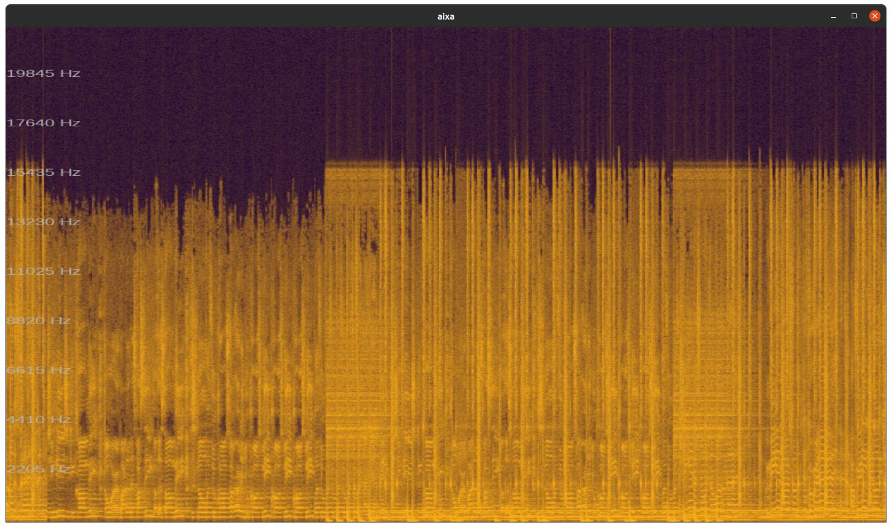

## About Aixa

Aixa is a multiplatform audio player. It can reproduce `wav` and `mp3` files, and displays a spectrogram of what is being played. 

*I do not own any rights of the sound displayed in this image*

The whole project has been written from scratch, using C++17. Qt is the main dependency, but its usage has been restricted to provide a cross-platform compatibility layer. 

So, within Aixa you can find:
* Usage of modern C++ features
* A MP3 decoder, written entirely from scratch
* Two Fourier Transform implementations, one of them being an FFT
* Shared data structures (From minute zero, Aixa was conceived as a multithreading application)
* OpenGL shaders for drawing basic shapes and text, with minimal external libraries required

In case you're working on a project which requires any of those, feel free to navigate the source, and take from it those parts that might help you. See [license](#license) for further details.

## Motivation

There is already plenty of applications which do the same than this one. Why another audio player? 

Basically, I use it as an excuse for learning and sharpening my skills on several topics I'm heavily interested on:
* Modern, real-time, C++
* Digital Signal Processing, and more specifically, audio processing
* Graphics programming

And also, because doing it is really fun!

## Compile and run

Aixa has been tested on GNU/Linux (ubuntu) and Windows. Refer to the `/doc` directory for instructions about building for your specific platform:

* [Linux](doc/BUILD_Linux.md)
* [Windows](doc/BUILD_Windows.md)

It hasn't been tested on macOS, but it should work on it with very minor tweaks. 

## Usage

Once you have the application compiled and running, simply drag'n'drop a `wav` or `mp3` file on it, and it will start playing. Use keyboard's up/down arrows to change the volume.

## Roadmap

Despite this can hardly be called a _product_, there is a list of changes pending to be implemented:
* Upgrade to C++20. Start using concepts and compile-time polymorphism when applicable
* Migrate to Vulkan
* Upgrade to Qt 6
* Apply video filters to the visualization
* Synthesize some instruments' sounds  
* Implement matrix multiplication and FFT in CUDA or OpenCL. Let the final implementation be decided at runtime.
* Detect invalid matrices operations at compile time, instead of runtime (Isn't that cool?)

## Troubleshooting

### I'm using Ubuntu, and when I drop a file on the application, it doesn't play

In last Ubuntu releases, drag and drop behavior seems to be broken. I strongly suggest following the instructions on [this post](https://ubuntuhandbook.org/index.php/2020/10/enable-drag-drop-desktop-ubuntu-20-04/) in order to install a GNOME extension that fixes it. 

### My MP3 file doesn't play
#### Has the file other media attached to it?

Some media converters embed in the generated file thinks like  thumbnails. Aixa hasn't the functionality to skip this meta-information, so it will reject the file. Please, use another converter which only generates pure audio data.   

#### Is it a stereo file?

When encoding a stereo file, the encoder can choose to use an extension called _intensity stereo_. The usage of this extension turns decoding quite more complex, so I haven't implemented it (yet) since it doesn't appear to be used very often in practice. As a workaround, generate a single channel file from the one you're using (or just try another song!)  

#### Anything else...

Keep in mind I've been working on this on my own and mostly for fun. Bugs may appear here and there. If you'd like to report a bug, open an [issue](https://github.com/priera/aixa/issues) or [contact me](#contact)

## License

Distributed under the MIT License. See `LICENSE.txt`

## Contact

Pedro Riera - [mail@rieramartorell.cat](mailto:mail@rieramartorell.cat)

Project: [Aixa](https://github.com/priera/aixa)