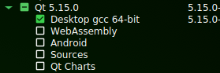

### Install system requirements
In ubuntu: 
```shell
sudo apt install g++ cmake mesa-common-dev libfreetype-dev libxcb-xinerama0
```

For other distros, you'll need to adapt accordingly the previous command.


### Prepare the project environment
Create the directory structure for the project. Let's call it `aixaEnv`:

```shell
mkdir aixaEnv
cd aixaEnv
export AIXA_DIR=$(pwd)
git clone git@github.com:priera/aixa.git
mkdir build
mkdir deps
```

### Install Qt
**Important note:** Despite there are `apt` packages for all Qt 5 components, this project assumes a manual Qt installation. So, although you may have those packages already installed, you should still follow this section. Otherwise, later steps won't work. I chose this option because it unifies both Linux and Windows' environments.    

Download Qt's Online Installer [from here](https://www.qt.io/download-qt-installer).

Run the installer. You may need to create a Qt account as Open Source developer in order to be able to install any module. Don't worry, it's free as free beer.

When prompted for installation directory, select `aixaEnv/deps/Qt`

From version `5.15.0`, select the main component and proceed with the installation. That's the only component this project requires.



### Compile the project

Example for generating a Release build. For other kinds of builds, steps are analogous.

```shell
cd $AIXA_DIR
mkdir build/release
cd build/release
cmake -DCMAKE_BUILD_TYPE=Release -DAIXA_DIR="$AIXA_DIR" "$AIXA_DIR/aixa/"
make
```

Or just pick up your favorite IDE, set up the environment and build from there.

## Execute

**From the `$AIXA_DIR/aixa` directory** run this command for the build just compiled:

```shell
$AIXA_DIR/build/release/src/aixa
```

(I'll do an `install` target some day, but for now this is what it is)

If everything went fine, app's main screen should appear