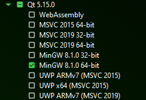

### Install system requirements

This project uses `MinGW` as compiler, as provided by the [MSYS2](https://www.msys2.org/) package system. Follow the instructions on the previous link in order to have the environment ready in a few minutes.

One of the dependencies requires [this](https://www.microsoft.com/en-us/download/details.aspx?id=52685) specific version of MSVC redistributable to be installed.

You should also install [cmake](https://cmake.org/download/).

### Prepare the project environment

Create a folder for the project. Let's call it `aixaEnv`. Clone this project inside that folder, and then create two more, `deps` and `build`. You should end up with the following folder hierarchy: 
```
aixaEnv
    build
    deps
    aixa
```

Store the full path of the `aixaEnv` directory in an environment variable, `%AIXA_DIR%`

### Install project's dependencies

#### Qt
Download Qt's Online Installer [from here](https://www.qt.io/download-qt-installer).

Run the installer. You may need to create a Qt account as Open Source developer in order to be able to install any module. Don't worry, it's free as free beer.

When prompted for installation directory, select `aixaEnv\deps\Qt`

From version `5.15.0`, select the main component and proceed with the installation. That's the only component this project requires. Make sure you choose one built with the MinGW toolchain.



#### Freetype
FreeType is used to parse `.ttf` font files and render them in memory. Despite being a tool for GNU/Linux, there is an independent Windows port in [this repo](https://github.com/ubawurinna/freetype-windows-binaries)

Just clone that repo in the `aixaEnv\deps` folder.

### Compile the project

Example for generating a Release build from a classic command prompt. For other kinds of builds, steps are analogous.

```
cd %AIXA_DIR%
mkdir build\release
cd build\release
cmake.exe -DCMAKE_BUILD_TYPE=Release -DAIXA_DIR="%AIXA_DIR%" "%AIXA_DIR%\aixa"
cmake.exe --build "%AIXA_DIR%\build\release" --target aixa
```

Or just pick up your favorite IDE, set up the environment and build from there.

## Execute

**From the `%AIXA_DIR%\aixa` directory** run this command for the build just compiled:

```
%AIXA_DIR%\build\release\src\aixa.exe
```

(I'll do an `install` target some day, but for now this is what it is)

If everything went fine, app's main screen should appear